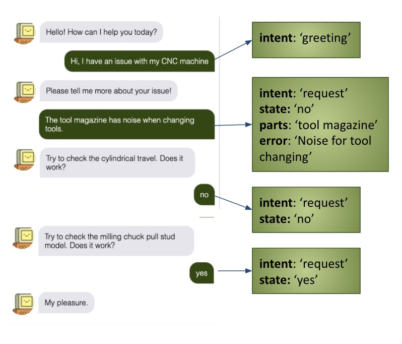

# Tutorial: Solving your problem with QAQ' Chatbot

We present QAQ' chatbot, a flexible chatbot system designed to make it easy to develop diagnosis chatbot system for industrial equipement. You may supply your data to our off-the-shelf components and get it running in minutes. You may also expand on our modular framework and build your component easily. Build your chatbot right now! To summarize, you have:

1. Off-the-shelf web interface
2. Automatic end-to-end chatbot training
3. Extensible framework

## Not sure? Try it!

We provide a working example of diagnosis chatbot based on the CNC milling machine. You can check the manual [here](cnc_machine_troubleshooting_1.pdf). Ask away and see how QAQ' responds!

## Overall Architecture

We handle the problem in three stages:
1. User interface: how the chatbot interacts with user
2. Natural Language Understanding(NLU): interpret user input to meaningful information for problem-solving
3. Dialogue Manager: Fetch the answer from database and generate human-friendly response

Here's a demo showing how it's done.

The interfaces between these components are already defined for you, so you only need to tackle the problems separately, saving your time to re-analyze/distribute the task. The below diagram shows the exchange of information between these components:

**User Interface** takes the user input text and pass it onto the NLU.

**NLU** takes the text and parse it into *intent* and *entities*, *intent* is what the user tries to do. *entities* are useful information for solving the problem (e.g., what machine part is the user referring to, what's the fault about it?)

**Dialogue Manager** takes the *intent* and *entities* from the NLU and determines whether it can a) return an answer or b) request more information, basing on the information given. It then issues a response to be displayed to the user interface.

## Customize with your data

For different problem, the NLU needs to be adapted to be sensitive to the jargons of your specific machine. Same for the dialogue manager becuase your solution is specific to your machine. Things can get quite technical but QAQ' provides you with an easy way to handle it.

You will need to convert your manual to a csv file like (this)[]. Each row will need to include the **part** at fault, **error description** and **solution**. This will form the knowledge base for the chatbot!

Then you are done! You will need to run `train.py` and the program will automatically train the chatbot to fit your problem. You **will not** need a machine learning library like Pytorch or Tensorflow. It is all done in generic numpy!

## Testing your chatbot, and make it better

Run `main.py` and you will start a web interface for your chatbot. Talk to it and see what it can do. 

You can make it smarter by using it more. QAQ' will keep track of your enquiry history and determines the most likely solution to your error. So it gets better everytime you talks to it!

## So how does it work?

QAQ' is a system for very specfic problem. We assume that you are not interested in throwing in a detailed, thousand-page trouble shooting manual. It will probably work but not as well. The hard-lifting happens at the NLU. From your manual it will extracts useful words and associate them with corresponding errors. Then a given user sentence, it looks for these key words and tries to determine which error the user is referring to. 

Mathematically, we model user sentence as a sequence of word $[w_1, w_2, ...]$. We also define a key word set $W_e$ and the probability matrix $P$ where the $i$th row $j$th column refers to the probability of the $j$th error given the $i$th word $P_{i,j} = Pr(e_j|w_i)$. We then sum those probability up to obtain our estimate for the error. If vector $w$ is the indication vector of key words extracted from the user input, then the error estimate $r = w^TP$, a matrix multiplication.

For this to work, we assume that the user is going to refrain its language within the domain $W_e$, the size of $|W_e|$ is reasonable for a specific domain and that key words are good indication of the error, which has been shown to be true for the CNC robot. It should hold true for most manual because error description tends to be concise. The key word-error correlation matrix demonstrates that.

## How to go beyond QAQ'?

You can easily extend QAQ's functionality. If you want to build your own NLU using neural network (if you have conversation data), you will need to write a class which **inherits** the super class NLU and declares it in `main.py`.
	
	from your_nlu import YourNLU
	...
	nlu = YourNLU() # replace nlu = NB_NLU()

Then you are done! You can expect the nlu to receive text as input and connect properly with the default dialogue manager.

	
